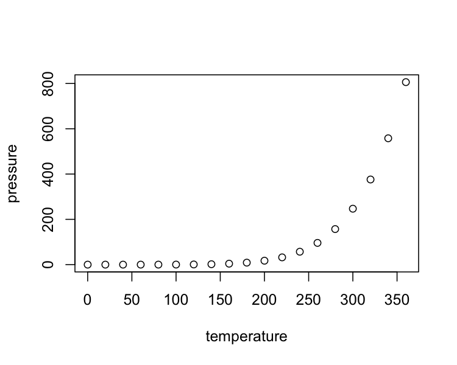

The important effect of X on Y
================
RW Morris1,2

 

1.  Lorem ipsum dolor sit amet, consectetur adipiscing elit. Donec
    porttitor justo turpis, eget auctor felis
2.  Maecenas lorem dolor, aliquam a nisi sed, elementum congue mi

 

**Corresponding author:**

    Professor Harry Potter  
    Faculty of the Dark Arts,   
    University of Hogwarts,  
    Scotland,  
    Great Britain  
    email: harry.potter@hogwart.edu.uk

 

|                |                   |
| -------------- | ----------------- |
| Date rendered: | 14 November, 2020 |
| Words          | 3760 (max 4000)   |
| Tables         | 1                 |
| Figures        | 3                 |

   

**keywords:** Etiam condimentum, porta dolor, eget pretium

 

  

# Abstract

-----

Lorem ipsum dolor sit amet, consectetuer adipiscing elit. Maecenas
porttitor congue massa. Fusce posuere, magna sed pulvinar ultricies,
purus lectus malesuada libero, sit amet commodo magna eros quis urna.
Nunc viverra imperdiet enim. Fusce est. Vivamus a tellus. Pellentesque
habitant morbi tristique senectus et netus et malesuada fames ac turpis
egestas. Proin pharetra nonummy pede. Mauris et orci. Aenean nec lorem.
In porttitor. Donec laoreet nonummy augue. Suspendisse dui purus,
scelerisque at, vulputate vitae, pretium mattis, nunc. Mauris eget neque
at sem venenatis eleifend. Ut nonummy. Fusce aliquet pede non pede.
Suspendisse dapibus lorem pellentesque magna. Integer nulla. Donec
blandit feugiat ligula. Donec hendrerit, felis et imperdiet euismod,
purus ipsum pretium metus, in lacinia nulla nisl eget sapien. Donec ut
est in lectus consequat consequat. Etiam eget dui. Aliquam erat
volutpat. Sed at lorem in nunc porta tristique. Proin nec augue. Quisque
aliquam tempor magna. Pellentesque habitant morbi tristique senectus.
(150 words/300 words max on first page)

  

  

  

  

  

  

-----

## Background

Donec ullamcorper fringilla eros. Fusce in sapien eu purus dapibus
commodo (Clark, 2018; Diener et al., 2017; Frijters et al., 2020;
Kahneman and Deaton, 2010). Cum sociis natoque penatibus et magnis dis
parturient montes, nascetur ridiculus mus. Kahneman and Deaton (2010)
cras faucibus condimentum odio. Kettlewell et al (2020) aliquam at eros.
Sed ac ligula. Etiam at ligula et tellus ullamcorper ultrices. In
fermentum, lorem non cursus porttitor, diam urna accumsan lacus, sed
interdum wisi nibh nec nisl. Ut tincidunt volutpat urna. Mauris eleifend
nulla eget mauris. Sed cursus quam id felis. Curabitur posuere quam vel
nibh. Cras dapibus dapibus nisl. Vestibulum quis dolor a felis congue
vehicula. Maecenas pede purus, tristique ac, tempus eget, egestas quis,
mauris (for review see Clark, 2018; but see Frijters et al., 2020).

Sed velit urna, interdum vel, ultricies vel, faucibus at, quam. Donec
elit est, consectetuer eget, consequat quis, tempus quis, wisi. In in
nunc. Class aptent taciti sociosqu ad litora torquent per conubia
nostra, per inceptos hymenaeos. Donec ullamcorper fringilla eros. Fusce
in sapien eu purus dapibus commodo. Cum sociis natoque penatibus et
magnis dis parturient montes, nascetur ridiculus mus. Cras faucibus
condimentum odio. Sed ac ligula.

 

## Method

Pellentesque habitant morbi tristique senectus et netus et malesuada
fames ac turpis egestas. Nunc ac magna. Maecenas odio dolor, vulputate
vel, auctor ac, accumsan id, felis. Pellentesque cursus sagittis felis.
Pellentesque porttitor, velit lacinia egestas auctor, diam eros tempus
arcu, nec vulputate augue magna vel risus. Cras non magna vel ante
adipiscing rhoncus. Vivamus a mi. Morbi neque. Aliquam erat volutpat.
Integer ultrices lobortis eros. Pellentesque habitant morbi tristique
senectus et netus et malesuada fames ac turpis egestas.

### Sub Method (H3)

Mauris eget neque at sem venenatis eleifend. Ut nonummy. Fusce aliquet
pede non pede. Suspendisse dapibus lorem pellentesque magna. Integer
nulla. Donec blandit feugiat ligula. Donec hendrerit, felis et imperdiet
euismod, purus ipsum pretium metus, in lacinia nulla nisl eget sapien.
Donec ut est in lectus consequat consequat. Etiam eget dui. Aliquam erat
volutpat.

#### Sub Method (H4)

Proin semper, ante vitae sollicitudin posuere, metus quam iaculis nibh,
vitae scelerisque nunc massa eget pede. Sed velit urna, interdum vel,
ultricies vel, faucibus at, quam.

##### Sub Method (H5)

Sed velit urna, interdum vel, ultricies vel, faucibus at, quam. Donec
elit est, consectetuer eget, consequat quis, tempus quis, wisi. In in
nunc. Class aptent taciti sociosqu ad litora torquent per conubia
nostra, per inceptos hymenaeos. Donec ullamcorper fringilla eros. Fusce
in sapien eu purus dapibus commodo. Cum sociis natoque penatibus et
magnis dis parturient montes, nascetur ridiculus mus. Cras faucibus
condimentum odio. Sed ac ligula.

###### Sub Method (H6)

Aliquam erat volutpat. Sed at lorem in nunc porta tristique. Proin nec
augue. Quisque aliquam tempor magna. Pellentesque habitant morbi
tristique senectus et netus et malesuada fames ac turpis egestas. Nunc
ac magna. Maecenas odio dolor, vulputate vel, auctor ac, accumsan id,
felis.

# There is an invisible subheading (H7)

It appears under the “Normal” style, but will not be listed in ToC or
indexes. Any heading subordinate to “H7” (e.g., “H8”, “H9” etc) will
have the same properties of “H7”. It will appear as the same as
subheading H7 (“Normal”) and not indexed.

 

Text can be quoted:

> This text has a unique MS-Word style “Block Text”. It is unlikely to
> be useful since it looks so ugly in HTML. Proin semper, ante vitae
> sollicitudin posuere, metus quam iaculis nibh, vitae scelerisque nunc
> massa eget pede. Sed velit urna, interdum vel, ultricies vel, faucibus
> at, quam. Donec elit est, consectetuer eget, consequat quis, tempus
> quis, wisi. In in nunc. Class aptent taciti sociosqu ad litora
> torquent per conubia nostra, per inceptos hymenaeos. Donec ullamcorper
> fringilla eros.

 

**Bold text can look like a heading**  
But you need to watch the line breaks. Integer ultrices lobortis eros.
Pellentesque habitant morbi tristique senectus et netus et malesuada
fames ac turpis egestas. Proin semper, ante vitae sollicitudin posuere,
metus quam iaculis nibh, vitae scelerisque nunc massa eget pede. Sed
velit urna, interdum vel, ultricies vel, faucibus at, quam.

*Italicized text can also look like a heading*  
But line breaks are again important. Pellentesque cursus sagittis felis.
Pellentesque porttitor, velit lacinia egestas auctor, diam eros tempus
arcu, nec vulputate augue magna vel risus. Cras non magna vel ante
adipiscing rhoncus.

 

## Results

Pellentesque cursus sagittis felis. Pellentesque porttitor, velit
lacinia egestas auctor, diam eros tempus arcu, nec vulputate augue magna
vel risus. Cras non magna vel ante adipiscing rhoncus. Vivamus a mi.
Morbi neque. Aliquam erat volutpat. Integer ultrices lobortis eros.
Pellentesque habitant morbi tristique senectus et netus et malesuada
fames ac turpis egestas.

You can print pretty tables using flextable like
this:

|                   |  mpg | cyl | disp |  hp | drat |    wt |  qsec | vs | am | gear | carb |
| :---------------- | ---: | --: | ---: | --: | ---: | ----: | ----: | -: | -: | ---: | ---: |
| Mazda RX4         | 21.0 |   6 |  160 | 110 | 3.90 | 2.620 | 16.46 |  0 |  1 |    4 |    4 |
| Mazda RX4 Wag     | 21.0 |   6 |  160 | 110 | 3.90 | 2.875 | 17.02 |  0 |  1 |    4 |    4 |
| Datsun 710        | 22.8 |   4 |  108 |  93 | 3.85 | 2.320 | 18.61 |  1 |  1 |    4 |    1 |
| Hornet 4 Drive    | 21.4 |   6 |  258 | 110 | 3.08 | 3.215 | 19.44 |  1 |  0 |    3 |    1 |
| Hornet Sportabout | 18.7 |   8 |  360 | 175 | 3.15 | 3.440 | 17.02 |  0 |  0 |    3 |    2 |
| Valiant           | 18.1 |   6 |  225 | 105 | 2.76 | 3.460 | 20.22 |  1 |  0 |    3 |    1 |

Table 1. Heading style is named table heading

 

Figures presented in the results will need to have numbered titles and
legends, for
    example:

 

##### Figure 1. Figure title H5

<!-- -->

    Figure 1 legend: Plots also need a figure legend. Fusce in sapien eu purus dapibus commodo. Cum sociis natoque penatibus et magnis dis parturient montes, nascetur ridiculus mus. Cras faucibus condimentum odio. Sed ac ligula. Aliquam at eros. 

 

## Discussion

Donec ullamcorper fringilla eros. Fusce in sapien eu purus dapibus
commodo (Clark, 2018; Diener et al., 2017; Frijters et al., 2020;
Kahneman and Deaton, 2010). Cum sociis natoque penatibus et magnis dis
parturient montes, nascetur ridiculus mus. Kahneman and Deaton (2010)
cras faucibus condimentum odio. Kettlewell et al (2020) aliquam at eros.
Sed ac ligula. Etiam at ligula et tellus ullamcorper ultrices. In
fermentum, lorem non cursus porttitor, diam urna accumsan lacus, sed
interdum wisi nibh nec nisl. Ut tincidunt volutpat urna. Mauris eleifend
nulla eget mauris. Sed cursus quam id felis. Curabitur posuere quam vel
nibh. Cras dapibus dapibus nisl. Vestibulum quis dolor a felis congue
vehicula. Maecenas pede purus, tristique ac, tempus eget, egestas quis,
mauris (for review see Clark, 2018; but see Frijters et al., 2020).

Sed velit urna, interdum vel, ultricies vel, faucibus at, quam. Donec
elit est, consectetuer eget, consequat quis, tempus quis, wisi. In in
nunc. Class aptent taciti sociosqu ad litora torquent per conubia
nostra, per inceptos hymenaeos. Donec ullamcorper fringilla eros. Fusce
in sapien eu purus dapibus commodo. Cum sociis natoque penatibus et
magnis dis parturient montes, nascetur ridiculus mus. Cras faucibus
condimentum odio. Sed ac ligula.

  

# References

Clark, A.E., 2018. Four decades of the economics of happiness: Where
next? Review of Income and Wealth 64, 245–269.

Diener, E., Heintzelman, S.J., Kushlev, K., Tay, L., Wirtz, D., Lutes,
L.D., Oishi, S., 2017. Findings all psychologists should know from the
new science on subjective well-being. Canadian Psychology/psychologie
canadienne 58, 87.

Frijters, P., Clark, A.E., Krekel, C., Layard, R., 2020. A happy choice:
Wellbeing as the goal of government. Behavioural Public Policy 4,
126–165.

Kahneman, D., Deaton, A., 2010. High income improves evaluation of life
but not emotional well-being. Proceedings of the national academy of
sciences 107, 16489–16493.

Kettlewell, N., Morris, R.W., Ho, N., Cobb-Clark, D.A., Cripps, S.,
Glozier, N., 2020. The differential impact of major life events on
cognitive and affective wellbeing. SSM-population health 10, 100533.

